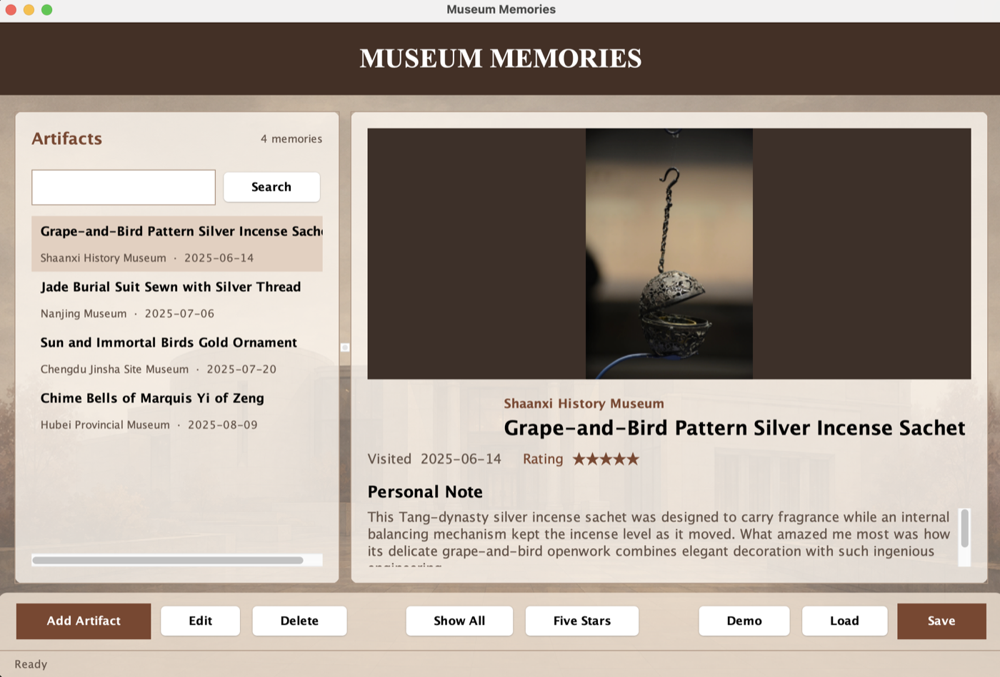
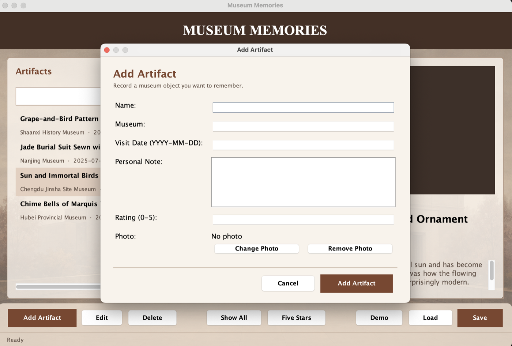
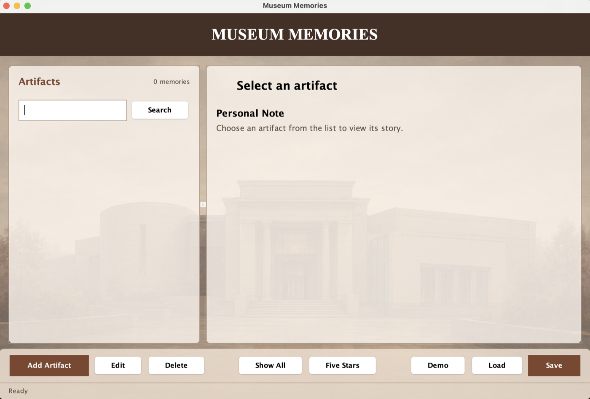

# Museum Memories

Museum Memories is a Java desktop application for preserving meaningful museum visits. It lets users record artifacts with a museum, visit date, rating, personal note, and optional photo, then search, edit, delete, save, and reload the collection.

## Why I built it

Museum visits often leave behind scattered photos and notes. I built Museum Memories to organize those materials into a personal archive that is easy to revisit. The project began as a UBC CPSC 210 course project and has since been extended with a selectable detail view, photo importing, full collection management, validation, search, and a public demo mode.

## Features

- Add artifacts with a name, museum, visit date, rating, personal note, and optional photo
- Import JPG, JPEG, and PNG files into an application-managed image directory
- Browse artifacts in a selectable list and view their full details
- Search by artifact name, museum, or personal note
- Edit details and change or remove a photo
- Delete artifacts with confirmation
- Filter the collection to five-star artifacts
- Save and load private data as JSON
- Load a separate public demo collection
- Read older JSON files that do not contain newer fields

## Screenshots

### Public demo collection



### Adding a new artifact



### Empty private collection



## Technology

- Java 11
- Java Swing
- Gradle
- JSON persistence with `org.json`
- JUnit 5
- Local file handling with `java.nio.file`

## Run the application

Requirements: Java 11 or newer.

```bash
./gradlew run
```

The main class is `ui.Main`.

## Run the tests

```bash
./gradlew test
```

## Data and photo storage

Private user data is stored locally:

```text
data/artifacts.json
data/images/
```

When a photo is selected, the application copies it into `data/images/` using a unique filename. JSON stores a relative path to that copy, so moving or deleting the original source photo does not break the application.

Both private paths are excluded from Git. They should not be committed because artifact notes may be personal and older records may contain absolute filesystem paths.

Public demonstration content is stored separately:

```text
data/demo-artifacts.json
data/demo-images/
```

Use the Demo button to load four public sample records. The artifact photos used in the demo are sourced from the Internet; details are recorded in `data/demo-images/README.md`.

## Project structure

```text
src/main/model/          Artifact data and collection operations
src/main/persistence/    JSON reading and writing
src/main/ui/             Swing GUI and console interface
src/test/                Model and persistence tests
data/                    Private, demo, and test data
lib/                     Course-compatible local dependencies
```

## Design decisions

- Data stays local; no account, server, or cloud storage is required.
- Imported photos are copied instead of referencing their original absolute paths.
- Public demo content is separated from private user content.
- The GUI uses a selectable `JList` so edit and delete actions operate on an explicit artifact.
- Model and persistence behavior is tested independently from Swing dialogs.

## Known limitations

- The application is single-user and local-only.
- Removing or replacing a photo does not delete the old copied file automatically, which avoids accidental file deletion but can leave unused images.
- GUI behavior is verified manually; automated tests focus on the model and persistence layers.

## Acknowledgements

The original project structure, JSON serialization approach, event log, and portions of the UI organization were developed for UBC CPSC 210 and were based in part on course examples including `JsonSerializationDemo`, the Teller application, and the Alarm System application. The background and artifact icon were generated with OpenAI's ChatGPT. The photos of these artifacts used in the demo are sourced from the Internet.
